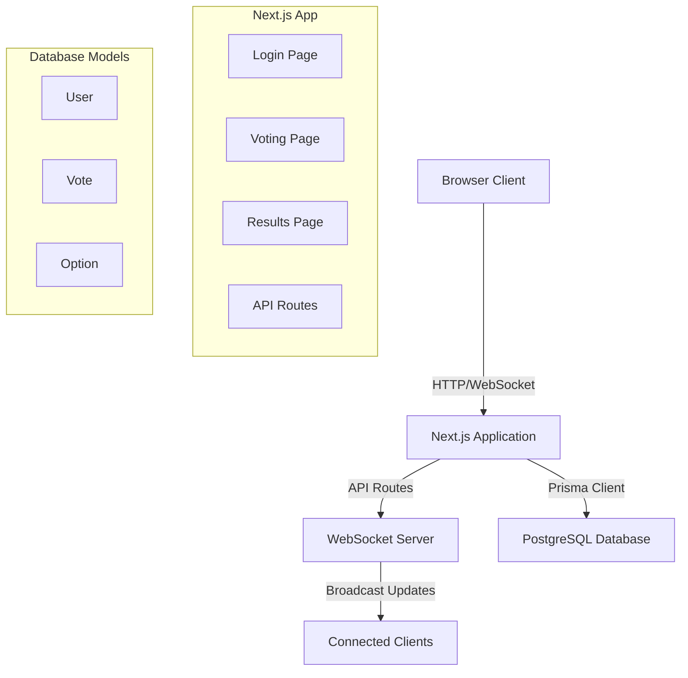

# Design Document

## Overview

The real-time voting application will be built using Next.js with a PostgreSQL database via Prisma ORM. The system will implement WebSocket connections for real-time updates and use session-based authentication for vote tracking. The application follows a three-page flow: Login → Voting → Results, with real-time synchronization across all connected clients.

## Architecture

### Technology Stack
- **Frontend**: Next.js 15.5.4 with React 19.1.0
- **Backend**: Next.js API routes with custom WebSocket server
- **Database**: PostgreSQL with Prisma ORM
- **Real-time Communication**: WebSockets (ws library)
- **Styling**: Tailwind CSS
- **Session Management**: Next.js sessions with cookies
- **Charts**: Chart.js or Recharts for result visualization

### System Architecture



## Components and Interfaces

### Frontend Components

#### 1. LoginPage Component
- **Purpose**: Handle user name input and session creation
- **Props**: None
- **State**: `name` (string), `error` (string), `loading` (boolean)
- **Methods**: 
  - `handleSubmit()`: Validates input and creates session
  - `handleNameChange()`: Updates name state

#### 2. VotingPage Component
- **Purpose**: Display voting options and handle vote submission
- **Props**: `user` (User object), `options` (Option[])
- **State**: `selectedOption` (number), `hasVoted` (boolean), `loading` (boolean)
- **Methods**:
  - `handleVoteSubmit()`: Submits vote and redirects to results
  - `handleOptionSelect()`: Updates selected option

#### 3. ResultsPage Component
- **Purpose**: Display live voting results with charts
- **Props**: `initialResults` (VoteResults)
- **State**: `results` (VoteResults), `connected` (boolean)
- **Methods**:
  - `connectWebSocket()`: Establishes WebSocket connection
  - `updateResults()`: Updates results from WebSocket messages
  - `renderChart()`: Renders vote distribution chart

#### 4. VoteChart Component
- **Purpose**: Render vote results as bar/pie chart
- **Props**: `data` (ChartData), `type` ('bar' | 'pie')
- **Methods**: 
  - `formatChartData()`: Transforms vote data for chart library

### Backend API Routes

#### 1. `/api/auth/login` (POST)
- **Purpose**: Create user session with name
- **Input**: `{ name: string }`
- **Output**: `{ success: boolean, user: User, sessionId: string }`
- **Logic**: Create/find user, generate session, set cookie

#### 2. `/api/auth/session` (GET)
- **Purpose**: Validate current session
- **Output**: `{ valid: boolean, user?: User, hasVoted?: boolean }`
- **Logic**: Check session cookie, return user data

#### 3. `/api/voting/options` (GET)
- **Purpose**: Retrieve available voting options
- **Output**: `{ options: Option[] }`
- **Logic**: Query all options from database

#### 4. `/api/voting/vote` (POST)
- **Purpose**: Submit user vote
- **Input**: `{ optionId: number }`
- **Output**: `{ success: boolean, message: string }`
- **Logic**: Validate session, check for existing vote, create vote record, broadcast update

#### 5. `/api/voting/results` (GET)
- **Purpose**: Get current vote tallies
- **Output**: `{ results: VoteResults }`
- **Logic**: Aggregate votes by option

### WebSocket Server

#### WebSocket Events
- **Connection**: `connection` - New client connects
- **Vote Update**: `vote-update` - Broadcast new vote results
- **Disconnect**: `disconnect` - Client disconnects

#### Message Format
```typescript
interface WebSocketMessage {
  type: 'vote-update' | 'connection-ack' | 'error'
  data: VoteResults | string
  timestamp: number
}
```

## Data Models

### Updated Prisma Schema Modifications

The existing schema needs minor adjustments for session-based voting:

```prisma
model User {
  id        Int      @id @default(autoincrement())
  name      String   // Remove email requirement, make name primary
  sessionId String   @unique // Add session tracking
  createdAt DateTime @default(now())
  updatedAt DateTime @updatedAt
  vote      Vote?
}

model Vote {
  id       Int     @id @default(autoincrement())
  userId   Int     @unique
  optionId Int
  createdAt DateTime @default(now())
  
  user     User    @relation(fields: [userId], references: [id])
  option   Option  @relation(fields: [optionId], references: [id])
}

model Option {
  id         Int     @id @default(autoincrement())
  optionName String  @unique
  votes      Vote[]
}
```

### TypeScript Interfaces

```typescript
interface User {
  id: number
  name: string
  sessionId: string
  hasVoted: boolean
}

interface Option {
  id: number
  optionName: string
  voteCount?: number
}

interface Vote {
  id: number
  userId: number
  optionId: number
  createdAt: Date
}

interface VoteResults {
  options: Array<{
    id: number
    name: string
    count: number
    percentage: number
  }>
  totalVotes: number
}

interface SessionData {
  userId: number
  name: string
  hasVoted: boolean
}
```

## Error Handling

### Client-Side Error Handling
- **Network Errors**: Display retry mechanisms for failed API calls
- **WebSocket Disconnection**: Auto-reconnect with exponential backoff
- **Validation Errors**: Show inline form validation messages
- **Session Expiry**: Redirect to login page with appropriate message

### Server-Side Error Handling
- **Database Connection**: Graceful degradation with error responses
- **Duplicate Vote Prevention**: Return specific error codes
- **Session Validation**: Clear invalid sessions and return 401
- **WebSocket Errors**: Log errors and attempt client reconnection

### Error Response Format
```typescript
interface ErrorResponse {
  success: false
  error: {
    code: string
    message: string
    details?: any
  }
}
```

## Testing Strategy

### Unit Tests
- **Components**: Test rendering, state management, and user interactions
- **API Routes**: Test request/response handling and business logic
- **Utilities**: Test session management and data transformation functions

### Integration Tests
- **Database Operations**: Test Prisma queries and data integrity
- **WebSocket Communication**: Test real-time message broadcasting
- **End-to-End Flows**: Test complete user journeys from login to results

### Test Tools
- **Jest**: Unit testing framework
- **React Testing Library**: Component testing
- **Supertest**: API endpoint testing
- **WebSocket Testing**: Custom WebSocket client for connection testing

### Performance Considerations
- **WebSocket Connection Limits**: Monitor concurrent connections
- **Database Query Optimization**: Index on frequently queried fields
- **Caching Strategy**: Cache vote results for faster initial page loads
- **Rate Limiting**: Prevent spam voting attempts

### Security Measures
- **Session Security**: Secure HTTP-only cookies
- **Input Validation**: Sanitize all user inputs
- **CORS Configuration**: Restrict WebSocket origins
- **SQL Injection Prevention**: Use Prisma's built-in protection